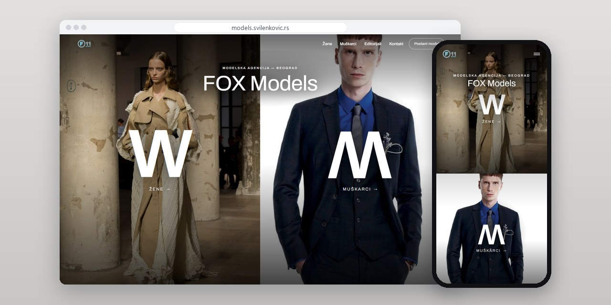
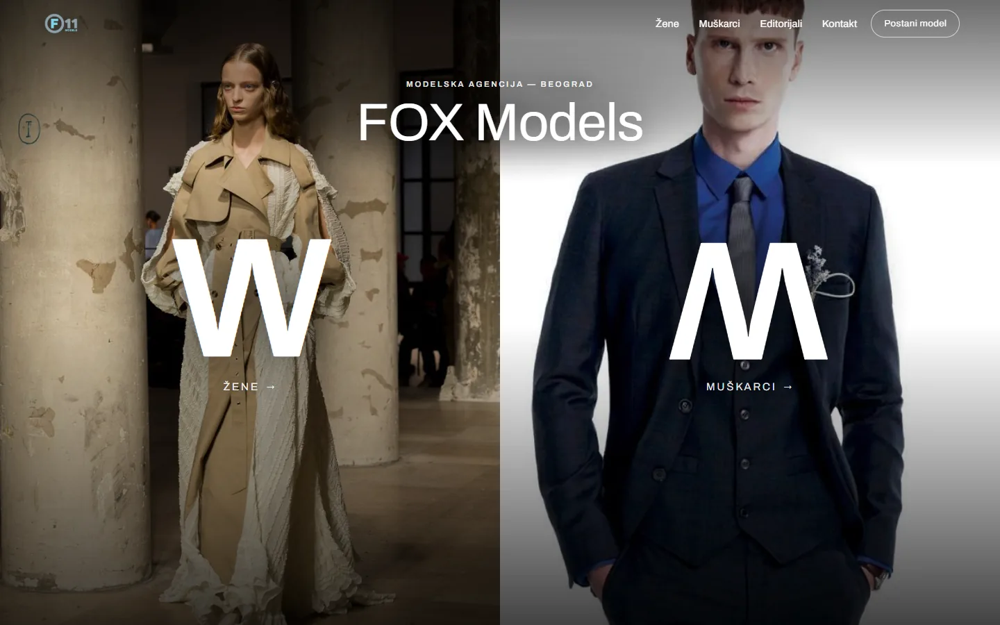
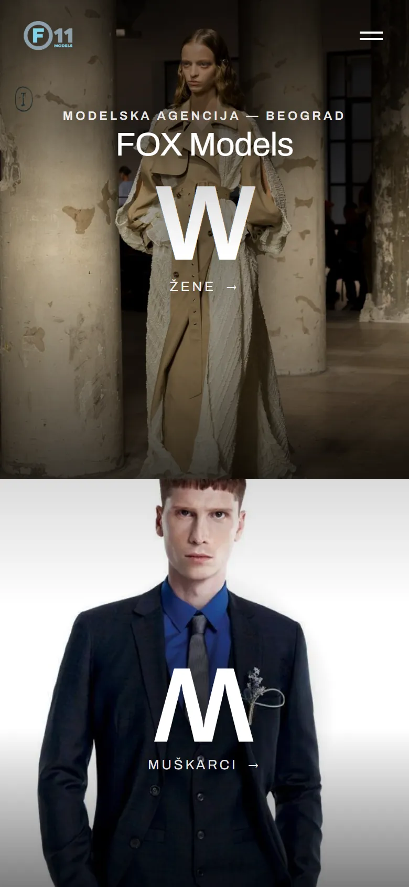
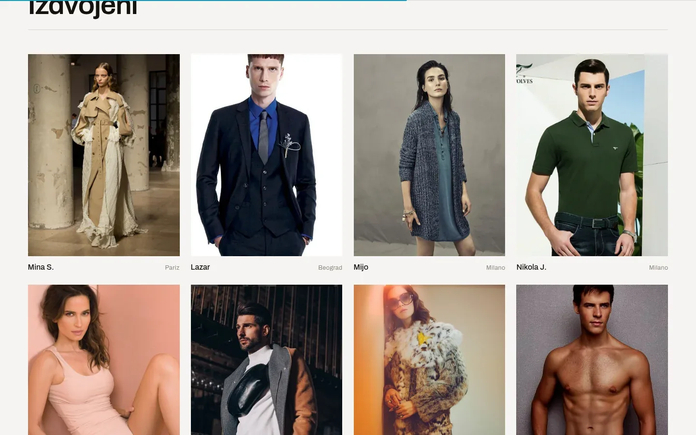
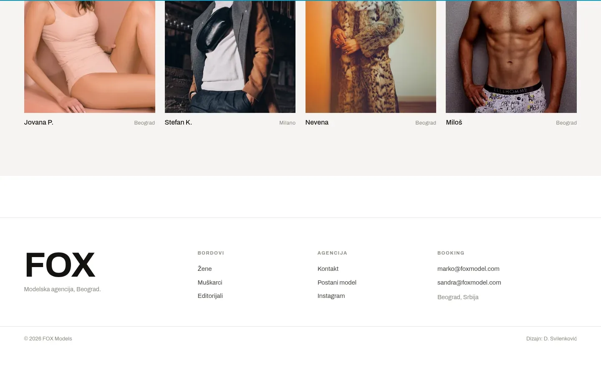

# FOX Models

Redizajn sajta modelske agencije iz Beograda: bordovi, profili modela sa merama, editorijali i prijava novih lica.

**[models.svilenkovic.rs](https://models.svilenkovic.rs/)** · [Studija slučaja](https://svilenkovic.rs/radovi/fox-models) · [English](README.md)

> [!NOTE]
> Klijentski projekat. Izvorni kod pripada klijentu i čuva se u privatnom repozitorijumu. Ova stranica opisuje šta sam uradio i kako.

<table>
  <tr><td><b>Klijent</b></td><td>FOX Models</td></tr>
  <tr><td><b>Delatnost</b></td><td>Modelska agencija</td></tr>
  <tr><td><b>Lokacija</b></td><td>Beograd</td></tr>
  <tr><td><b>Vrsta</b></td><td>Sajt sa više strana</td></tr>
  <tr><td><b>Moj deo posla</b></td><td>Redizajn, dizajn, izrada i SEO</td></tr>
  <tr><td><b>Tehnologije</b></td><td>HTML, CSS, vanilla JS, nginx</td></tr>
</table>

## O projektu

FOX Models je modelska agencija iz Beograda koja vodi ženski i muški bord, traži nova lica i radi za modne kuće, magazine i brendove, a ja radim redizajn njenog sajta. Na takvom sajtu fotografija je proizvod, pa sve ostalo mora da joj se skloni s puta. Ranija tamna verzija imala je 3D prsten fotografija, a ova svetla, bez ikakvog 3D-a, dobila je sve kasnije dorade i znatno jednostavniju naslovnu. Radna verzija stoji na mom poddomenu, zatvorena za indeksiranje, dok sadašnji sajt agencije ostaje na foxmodel.com.

Pisao sam je u čistom HTML-u, CSS-u i JavaScript-u, bez frameworka i bez build koraka, oko 70 KB sopstvenog koda u tri fajla. Fajl sa podacima ima ista polja kao kolone koje bi vraćala baza agencije, jedan model je jedan red, pa demo podaci mogu da se zamene pravom bazom bez diranja sajta. Za izmenu sadržaja dovoljno je prekopirati jedan fajl na server, dok je 3D verzija, kao Next.js projekat, tražila novi build.

## Šta sam uradio

- Naslovna podeljena na dva panela: W levo za ženski bord, M desno za muški, a M je isto slovo W okrenuto naopako
- Bordovi sa tabovima Main, New Faces i Commercial, pretragom po imenu dok se kuca i indeksom od A do Ž sa srpskim slovima, koji se pojavljuje tek od dvanaest modela
- Profil sa sopstvenom adresom i merama za svakog modela, i booking link koji otvara već popunjen mejl
- Zid editorijala sa lajtboksom koji radi i sa tastaturom i prevlačenjem, a dok je otvoren drži fokus unutar prikaza
- Popravljeno preusmerenje koje je gubilo parametre iz adrese, pa se umesto svakog profila otvarao prvi model sa spiska
- Odvojena pravila keša: CSS, JS i HTML se uvek proveravaju kod servera, a slike se čuvaju sedam dana

## Snimci ekrana

<table>
  <tr>
    <td width="68%" valign="top"></td>
    <td width="32%" valign="top"></td>
  </tr>
</table>

Sekcija "Izdvojeni": četiri lica iz ženskog i četiri iz muškog borda

Podnožje: bordovi, agencija i odvojene adrese za booking i skauting

---

Izrada: [D. Svilenković](https://svilenkovic.rs).
